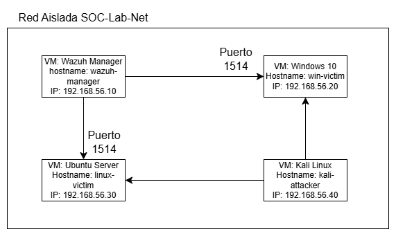

# Mini-SOC automatizado con IA para la detección y respuesta a amenazas

## Información del Proyecto

| Campo | Información |
|---|---|
| **Autor** | Karol Melissa Chacon Sanchez |
| **Fecha de inicio** | 20 de abril de 2026 |
| **Objetivo** | Implementar en un entorno de laboratorio simulado un centro de operaciones de seguridad (SOC) utilizando herramientas como SIEM y SOAR donde detecte, clasifique y responda de manera automática a amenzas |

---

    MiniSOC-Lab/
    ├── README.md
    ├── semana1/
    │   ├── imagenes/             
    │   │   └── DiagramaRed_SOC.png          ← Arquitectura del laboratorio
    │   └── rules/
    │       └── minisoc_lab.xml              ← 10 reglas de detección
    ├── semana2/                             
    │    └── evidencias/
    │        ├── E6_Shuffle_dashboard.png
    │        ├── E7_Wazuh_Shuffle_Integration.png
    │        ├── E8_PB-01 Bloqueo-IP.png
    │        ├── E9_PB-02 Alerta-Email.png
    │        ├── E10_PB-03 Ticket-Incidente.png
    │        ├── E11_Escenario 1 SSH Brute Force.png
    │        ├── E12_Escenerio 2 Creación de usuario nuevo.png
    │        ├── E13_Escenario 3 Sudo Privilege Escalation.png
    │        └── E14_Escenario 4 File Integrity violation.png
    └── semana3/                             ← (próximamente)

---

## Versiones del Software

| Software | Versión |
|---|---|
| VirtualBox | 7.2.8 r173730 |
| Ubuntu (Wazuh Manager) | 24.04.4 LTS |
| Ubuntu (Linux Victim) | 24.04.4 LTS |
| Wazuh SIEM/SOAR | 4.14.5-1 |
| Windows 10 (Win Victim) | Windows 11 Pro Versión 25H2 (OS Build 16200.8037) |
| Kali Linux | 2026.1 |

---

## Arquitectura de Red

**Red aislada:** `SOC-Lab-Net` — `192.168.56.0/24`  
**Hipervisor:** Oracle VirtualBox 7.2.8  
**Tipo de red:** Host-Only (aislada del exterior)

### Máquinas Virtuales

| VM | Hostname | IP Estática | Rol | RAM | Disco |
|---|---|---|---|---|---|
| wazuh-manager | wazuh-manager | 192.168.56.10 | SIEM + SOAR Central | 6194 MB | 50 GB|
| linux-victim | linux-victim | 192.168.56.30 | Víctima Linux | 2048 MB | 20 GB |
| win-victim | win-victim | 192.168.56.20 | Víctima Windows | 2048 MB | 64 GB |
| kali-attacker | kali-attacker | 192.168.56.40 | Atacante controlado | 3099 MB | 80 GB 

---

## Diagrama de la Arquitectura



### Configuración de Red por VM

1. wazuh-manager (192.168.56.10)
- **Adaptador 1:** Host-Only → `enp0s3` → IP estática `192.168.56.10/24`
- **Adaptador 2:** NAT → `enp0s8` 


2. linux-victim (192.168.56.30)
- **Adaptador 1:** Host-Only → `enp0s3` → IP estática `192.168.56.30/24`
- **Adaptador 2:** NAT 

3. win-victim (192.168.56.20)
- **Adaptador 1:** Host-Only → IP estática `192.168.56.20/24`

4. kali-attacker (192.168.56.40)
- **Adaptador 1:** Host-Only → IP estática `192.168.56.40/24`
- **Rol:** Ejecutar ataques controlados contra las VMs víctima

---

## Estado del Proyecto por Semana

### Semana 1: Infraestructura y Wazuh SIEM

| Día | Tarea | Estado |
|---|---|---|
| Día 1-2 | Diseño de red + instalación de VirtualBox | ✅ Completado |
| Día 3-4 | Instalación de Wazuh Manager en Ubuntu 24.04 | ✅ Completado |
| Día 5-6 | Agente linux-victim activo | ✅ Completado |
| Día 5-6 | Agente win-victim activo |  ✅ Completado |
| Día 5-6 | Kali Linux instalado | ✅ Completado |
| Día 7 | 10 reglas de detección (XML) | ✅ Completado |

### Semana 2: Shuffle SOAR y Escenarios de Ataque
| Tarea | Estado |
|---|---|
| Instalación de Shuffle SOAR | ✅ Completado |
| Creación de playbooks de respuesta automatizada | ✅ Completado |
| Escenario 1: SSH Brute Force | ✅ Completado |
| Escenario 2: Creación de usuario nuevo | ✅ Completado |
| Escenario 3: Sudo Privilege Escalation | ✅ Completado |
| Escenario 4: File Integrity: modificar /etc/passwd | ✅ Completado |
| Escenario 5: Windows RDP Brute Force | ⏳ Pendiente |

### Semana 3: Análisis, Métricas y Reporte Final
| Tarea | Estado |
|---|---|
| Análisis de alertas y métricas | ⏳ Pendiente |
| Mapeo MITRE ATT&CK | ⏳ Pendiente |
| Reporte final con evidencias | ⏳ Pendiente |
| Presentación del proyecto | ⏳ Pendiente |

---

## Entregables Completados

| Entregable | Archivo | Estado |
|---|---|---|
| E1 — Diagrama de arquitectura de red | DiagramaRed_SOC | ✅ |
| E2 — Dashboard Wazuh activo | Captura de pantalla | ✅ |
| E3 — Agente linux-victim activo | Captura de pantalla | ✅ |
| E4 — Agente win-victim activo | Captura de pantalla | ✅ |
| E5 — 10 reglas XML de detección | minisoc_lab.xml | ✅ |
| E6 — Shuffle SOAR instalado | Captura dashboard Shuffle | ✅ |
| E7 — Integración Wazuh → Shuffle | Captura Workflow Runs | ✅ |
| E8 — PB-01 Bloqueo-IP | Captura ejecución Shuffle | ✅ |
| E9 — PB-02 Alerta-Email | Captura configuración del nodo | ✅ |
| E10 — PB-03 Ticket-Incidente | Captura ticket creado | ✅ |
| E11 — Escenario 1: SSH Brute Force | Captura Wazuh - Kali | ✅ |
| E12 — Escenario 2: Creación de usuario nuevo | Captura Wazuh - CLI Victim (SSH) | ✅ |
| E13 — Escenario 3: Sudo Privilege Escalation | Captura Wazuh - CLI Victim (SSH) | ✅ |
| E14 — Escenario 4: File Integrity Violation | Captura Wazuh - CLI Victim (SSH) | ✅ |

---

## Comandos Útiles de Referencia

### Conectarse por SSH a las VMs
```bash
# Wazuh Manager
ssh wazuh@192.168.56.10

# Linux Victim
ssh victim@192.168.56.30
```
---

## Notas Técnicas

- La VM wazuh-manager usa **enp0s3** para la red Host-Only y **enp0s8** para NAT 
- El dashboard de Wazuh es accesible desde el host en: `https://192.168.56.10`
- El Shuffle es accesible en: `https://192.168.56.10:3001`

